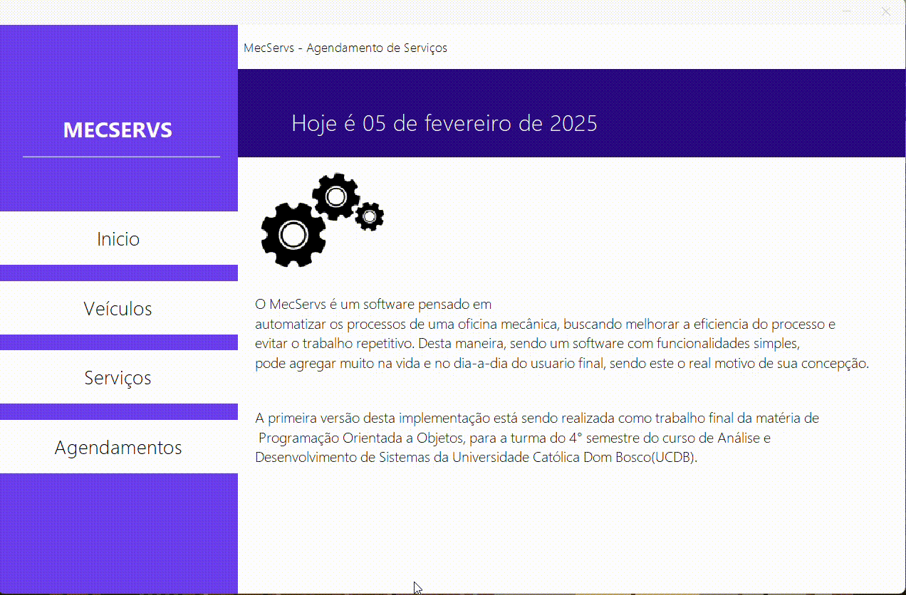

# MecServs

MecServs é uma aplicação desktop desenvolvida em Java que simula o funcionamento básico de uma loja de serviços automotivos.

Com o MecServs, é possível:

- Cadastrar veículos, diferenciando entre carros, motos e utilitários, cada um com atributos específicos.
- Cadastrar serviços oferecidos pela loja.
- Realizar agendamentos, relacionando veículos com os serviços cadastrados.

A aplicação foi desenvolvida 100% em Java, utilizando o Maven como gerenciador de pacotes e o Swing para a criação das interfaces. Além disso, foi implementado o tratamento de exceções e utilizado o banco de dados em memória H2.

## Tech Stack

## Getting Started

1. **Instalar dependências**: `mvn install`
2. **Configurar banco de dados**: O H2 é configurado automaticamente ao iniciar a aplicação.
3. **Executar aplicação**: `mvn exec:java`

## Contribute

1. **Clonar o projeto**: `git clone https://github.com/SEU-USUARIO/MecServs.git`
2. **Criar branch para a feature**: `git checkout -b feature/NOME`
